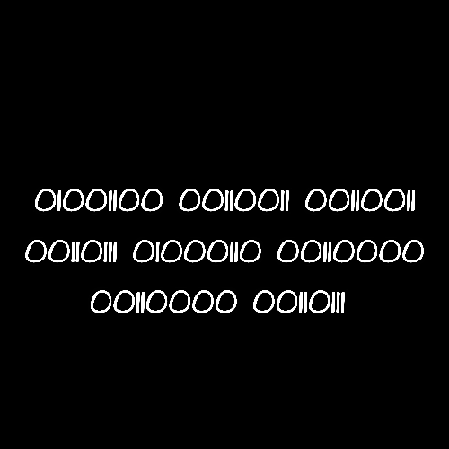

# Pingala.png

Found from [bitly plus frame](../01-bitly_plus_frame/README.md)

## Title

https://en.wikipedia.org/wiki/Pingala

## Binary

Binary translates to `L337F007` which gives http://bit.ly/L337F007.

This gives us [Lack.png](../03-Lack.png). An image name from the last puzzle, but
the file is different.

## TODO: Steganography
