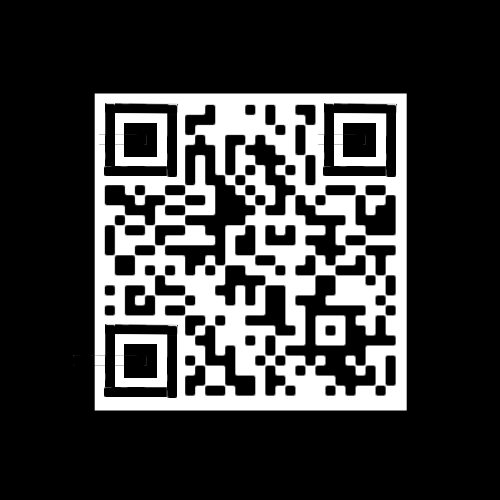

# Lack.png

Like with the last puzzle we need to fill in positional markers on the QR code.

## Reconstructed

## QR code data

`QR-Code:Go back and remove L33 and add R16H`

Using this on the bit.ly from the previous puzzle we get: http://bit.ly/R16H7F007

This gives us [AIZXXVI.png](../04-AIZXXVI.png/README.md)

## TODO: Steganography
