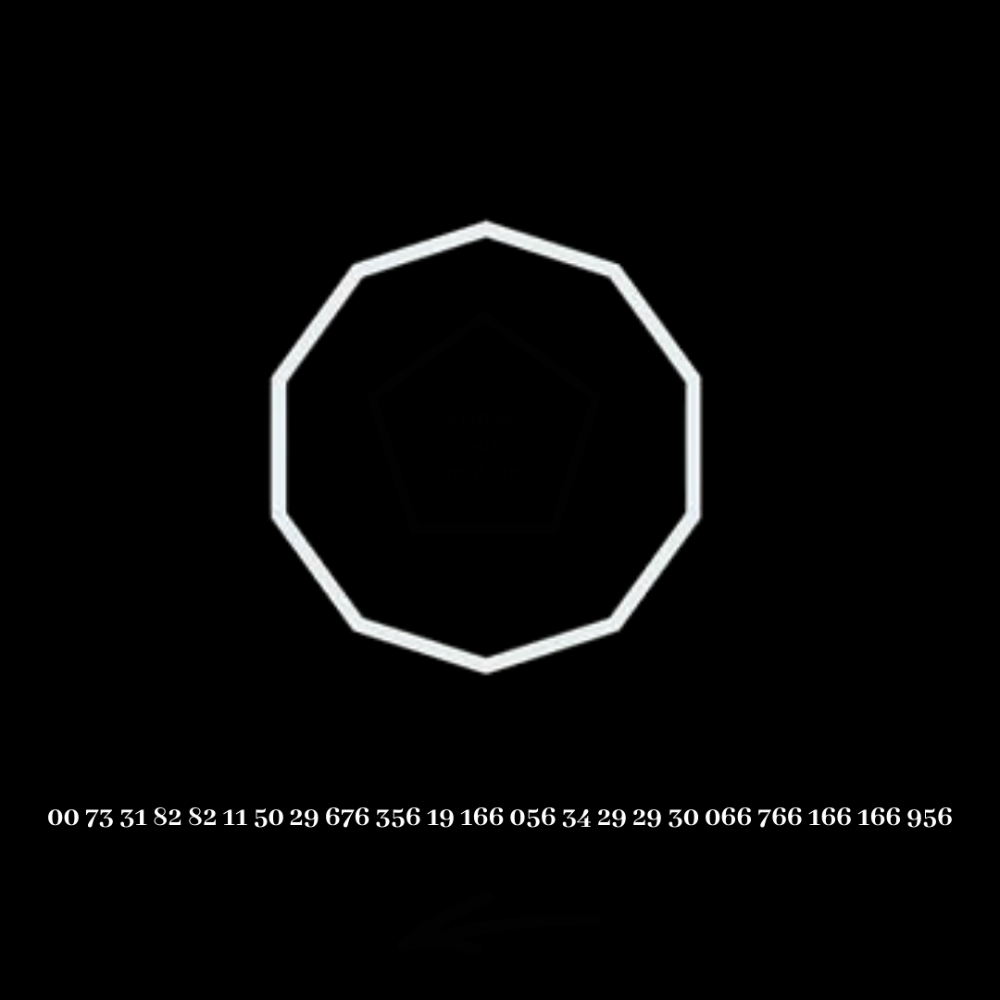
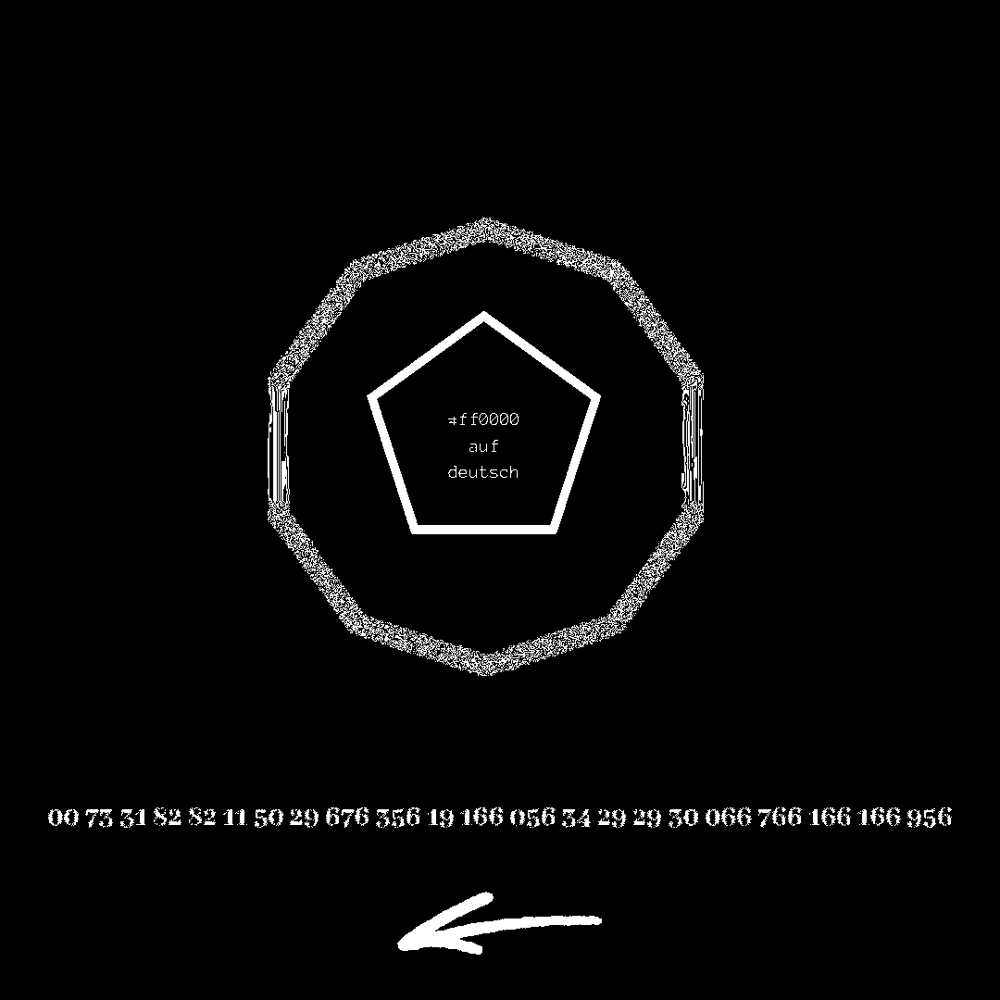

# Oncriptides.png



## Title

Dutch for `Small details make the difference`.

Later changed to Oncriptides

## Steganography



## Solving

`#ff0000` is red.

`auf deutsch` in German.

Red in german is `rot` so this is a ROT cipher or something needs to be rotated?

Or rot needs to be rotated = Tor

Later changed to Oncriptides = Anagram of description. In the description of the Google Drive image was the following code.

```
605 256 395 156 805 495 956 935 295 676 356 195 166 056 345 295 295 305 766 166 166 956

Reverse per arrow:
956 166 166 766 305 295 295 345 056 166 195 356 676 295 935 956 495 805 156 395 256 605
  h   t   t   p  :    /   /   b   i   t   .   l   y   /       h           j      k
  h   t   t   p  :    /   /   b   i   t   .   l   y   /  T    h   1   5   j   0   k   3

. 195  
/ 295
: 305

a 2
b 345
c 4
d 5
e 6
f 7
g 8
h 956
i 056
j 156
k 256
l 356
m 4
n 5
o 6
p 766
q 8
r 9
s 0
t 166
u 2
v 3
w 4
x 5
y 676
z     
```
