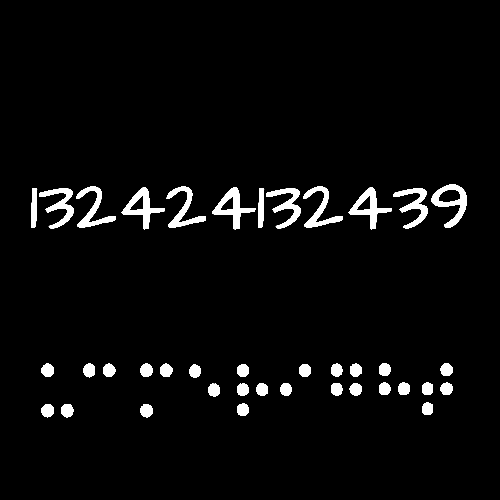

# Burning Brain.png

## Title

In `WhyI696342.png` we found out about John F Farnsworth, he was present in the room when Lincoln was shot in the head.

## Numbers

The numbers are a morbit cipher

Using `UCMERIGHT` as the keyword for 9 characters you get `ARGKRTS`.

The next URL is https://bit.ly/argkrts

## Braille

> ucmeright

## Trailing hex on file

> 66 75 74 62 61 6c 6f 20 65 6e 20 6c 61 20 6c 61 74 69 6e 61

futbalo en la latina

which means 'soccer in Latin'

Soccer is Morbi in Latin

This is a hint to use the Morbit cipher

## Loose Ends from this and WhyI696342.png

* ucmeright
