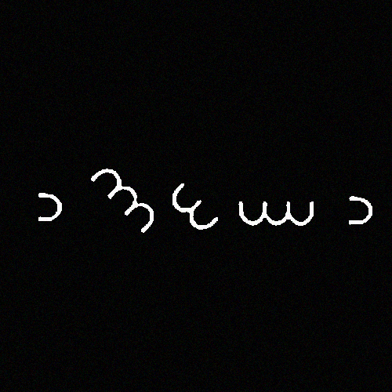

# WhyI696342.png

## Drive description

tekau ma waru

This means 18 in maori

18 - tekau mā waru

## Title

ROT+18 encoded title which changes to July 14, 1897.

This is the day [John Franklin Farnsworth](https://en.wikipedia.org/wiki/John_F._Farnsworth) died.

Farnsworth was present in the room the day Lincoln was assassinated.

## Symbols

The symbols are from the Dorabella cipher. They spell `nmywn` resulting in https://bit.ly/nmywn.

## Loose ends

* John Franklin Farnsworth was present when Lincoln was assassinated
