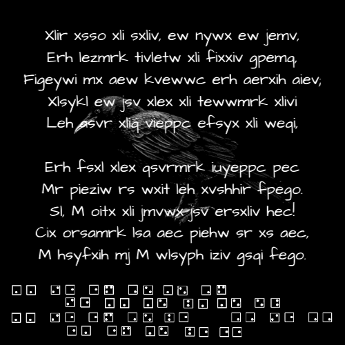
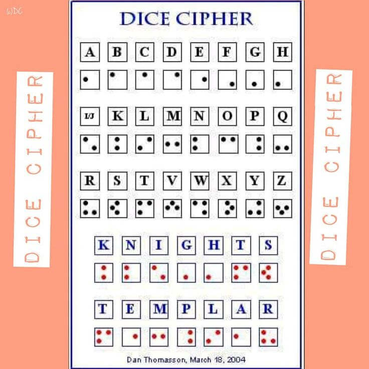

# Crow.png



## Trailing Data

`Tiberius Claudius Caesar Augustus Germanicus`

## Caesar Cipher
+4

This is "The Road not Taken" by Robert Frost

```
Then took the other, as just as fair,
And having perhaps the better claim,
Because it was grassy and wanted wear;
Though as for that the passing there
Had worn them really about the same,

And both that morning equally lay
In leaves no step had trodden black.
Oe, I kept the first for another day!
Yet knowing how way leads on to way,
I doubted if I should ever come back.
```

## Dice Cipher



Normal direction

```
gg le et fj gi ft
    le gg gj kg gi jp
gg le et fi ke ff le ff
    eg et gj ke ee
```

ROT+4

```
cc ha ap bf ce bp         3,3, 8,1, 1,16, 2,6, 3,5, 2,16
                            c    o     r    v    u     s
    ha cc cf gc ce fl      8,1, 3,3, 3,6,  7,3, 3,5, 6,12
                            o    c    s     l    u     m
cc ha ap be ga   bb ha bb 3,3, 8,1, 1,16, 2,5, 7,1,  2,2  8,1, 2,2
                            c    o     r    a    i     n    o    n
       ac ap cf ga aa     1,3, 1,16, 3,6, 7,1, 1,1
                            e     r    s    i    t          
```

I think there was a mistake in the puzzle or I transcribed something wrong.

`corvus oculum corvi non eruit` is latin for
`a raven will not pick out an eye of another raven`
