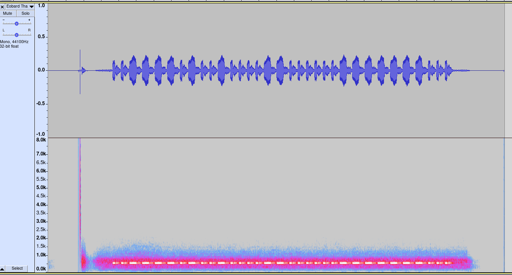
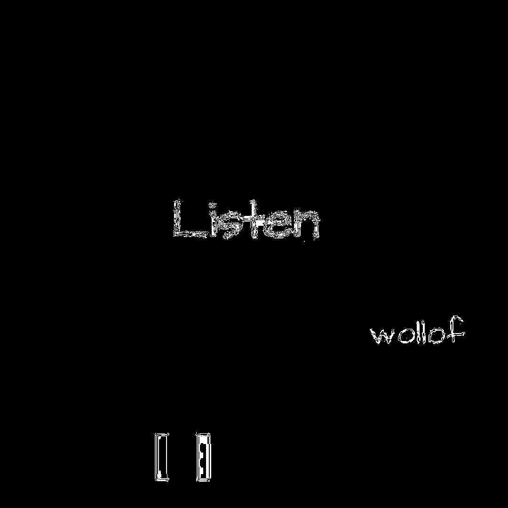
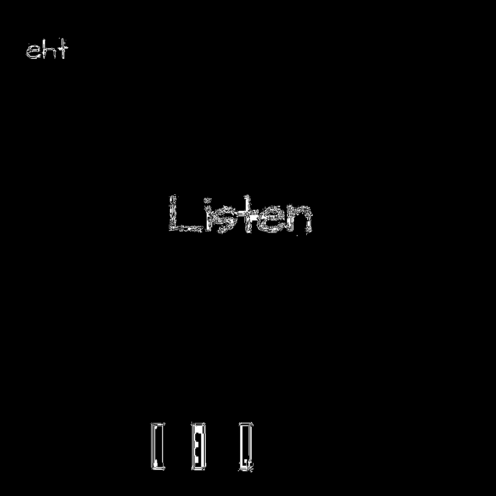
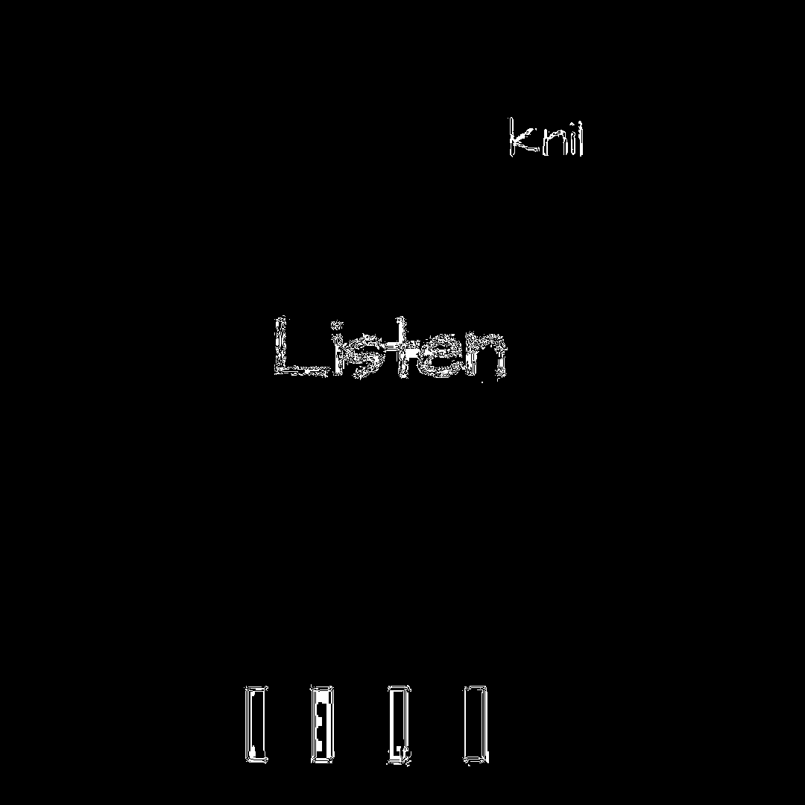

# Eobard Thawn.mp4

## Title

Eobard Thawn is the Reverse-Flash.

## Audio

The audio is unbroken morse code, you must find the breaks to produce valid text and reverse it



```
4:37 PM

Still no idea what to do with the audio or how to interpret the dot/dashes if it isn't morse

Today
sonsoftiberius 1:56 PM

in that sentence I did not actively participate but, I was told that the audio was "back to front" now I don't know if it is inverted or really back to front

sonsoftiberius 2:02 PM

the morse code must go out of this way after it is done, but as I have no idea how it is done ----- -.-. .- .. .. - .. .... ----- --...

ops,  wrong morse code

..--- -.-. .-.. .. --.. .... ----- --...
```

Translate to text: `30HITIIN0`
Reversed: `0NIITIH03`

Gives https://bit.ly/0NIITIH03

## Video

Hidden in the black is `follow the link` backwards.




