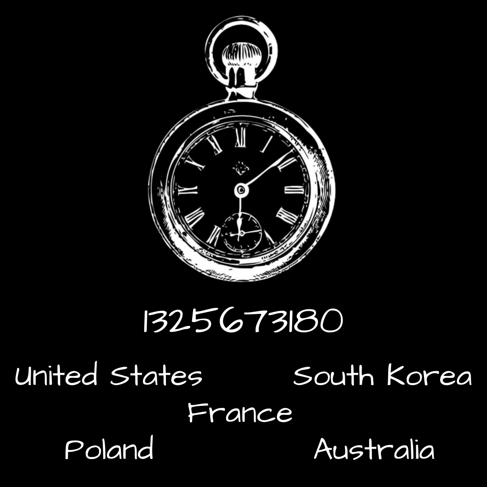

# A Deepness in the Sky.png



## Title

A novel by Vernor Vinge

## Epoch timestamp

The date Cicada 3301's first puzzle in 2012 was posted.

## Countries

The countries where Cicada dropped the QR code posters.

## Appended RAR

The appended RAR's password is `A Deepness in the Sky`

It contains `7A35090F.txt`, the contents are ```6f 6f 70 73 20 74 68 65 72 65 27 73 20 6e 6f 74 68 69 6e 67 20 68 65 72 65```

which is ASCII for `oops there's nothing here`
