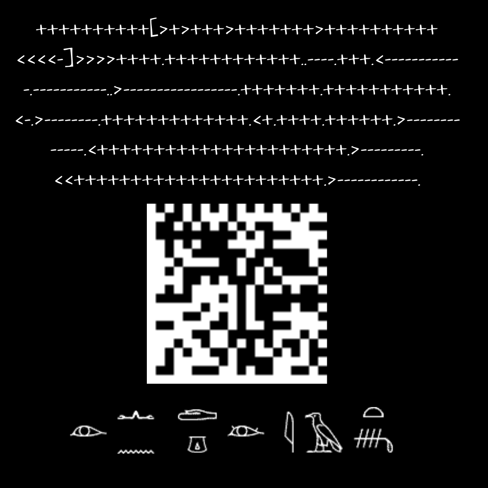

# Senza abbreviazioni.png



## Title

"Without abbreviations" in Italian

## Brainfuck

```
++++++++++[>+>+++>+++++++>++++++++++
<<<<-]>>>>++++.++++++++++++..----.+++.<-----------
-.-----------..>-----------------.+++++++.+++++++++++.
<-.>--------.+++++++++++++.<+.++++.++++++.>--------
-----.<++++++++++++++++++++++.>---------.
<<++++++++++++++++++++++.>------------.
```

Which compiles to: https://bit.ly/39lOc4C


## Data Matrix

https://imdb.to/2CAhe4q

## Hieroglyphs

For reference:

* [List of Egyptian hieroglyphs](https://en.wikipedia.org/wiki/List_of_Egyptian_hieroglyphs)
* [Transliteration of Ancient Egyptian](https://en.wikipedia.org/wiki/Transliteration_of_Ancient_Egyptian)

| Hieroglyph       | Description     | Transliteration | Phoenetic | Notes |
| :------------- | :----------: | :-----------: | :-----------: | :-----------: |
| 𓁹 | eye   | eye (jrt), make (mA), see (mAA), watch, to be watchful, to be awake (rs), to be blind (schp)  | jr (ḏ+r) biliteral, (mꜣ) (m + ꜣ) the biliteral in "lion" (mꜣj) | Osiris |
| 𓂜 | arms in gesture of negation | not (n) (nn), that that not (jwtj), do not know (ḫmj), shrine (ḫm), forget (me in smḫ) | n |
| 𓈖 |ripple of water | n | n | The letter n (+of,by)
| 𓂧 | hand with palm up | hand | d | 'red', in Egyptian hieroglyphs for word constructs
| 𓎼 | jar stand | seat | g
| 𓁺 | eye touched up with paint | eye (jrt), view (dgi), to be blind (schp)  |
| 𓇋 | reed | y | j | alphabetic uniliteral vowel y
| 𓄿 | egyptian vulture |  ꜣ (ah) | a | uniliteral sign representing Egyptian alef
| 𓏏 | loaf of bread | t | t | Uniliteral for "t"
| 𓄦 | backbone and ribs and spinal cord | (sh)'t, š't | jꜣt  | wounds, slaughter, carnage

This apparently means "do not look back" and relates to the soundtrack.
