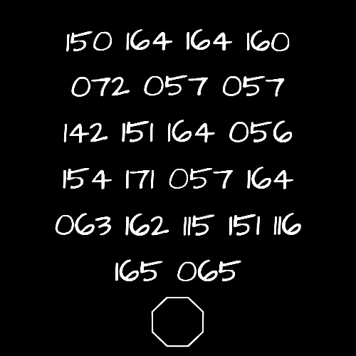
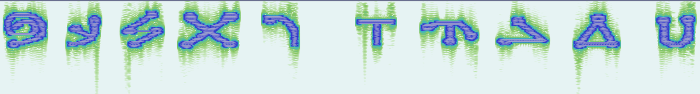

# 068 111 114 101 105 116.mp4

## Title

`Doreit` in ASCII

## Appended Image

`binwalk -D 'png image:png' 068\ 111\ 114\ 101\ 105\ 116.mp4`

This is a URL for http://bit.ly/t3rMiNu5

Which leads to a Google Drive folder called `[corrupted files]` and contains `Aleksándr Sergéyevich Púshkin.png` and another `step 13.rar`.

## Stereogram

