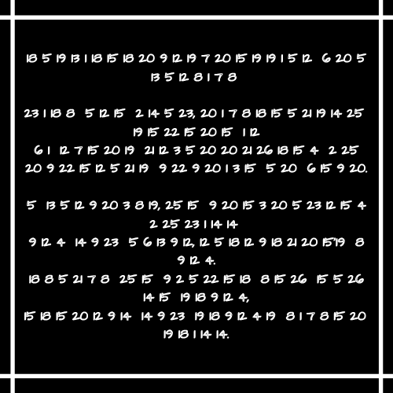
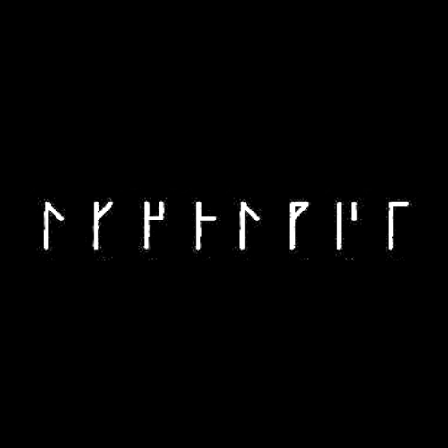
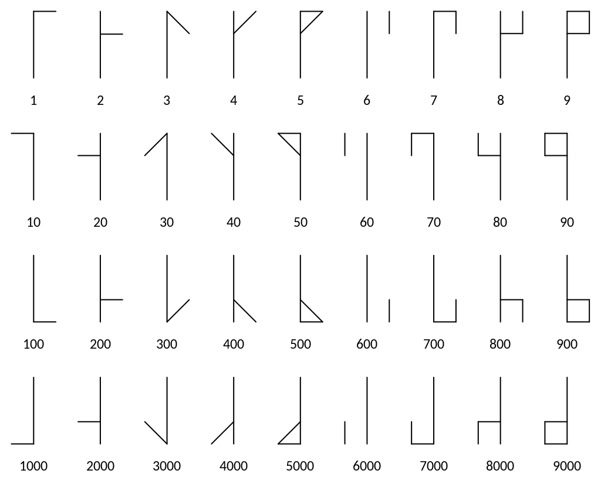

# Aleksándr Sergéyevich Púshkin.png



## Appended Data

### Image



Using the book the brainfuck compiles to. This appears to be a cistercian digits.



```
34823561
```

This is the password to extract `enie.png` from the second `step 13.rar`

### Brainfuck

> ++++++++++[>+>+++>+++++++>++++++++++<<<<-]>>>-------------.--.+.-----.++.----.++++.-----.+++++++.-.--.----.+.<++.>++++++++++++++++++++++++.++++++++++.-----------------.++++++++++++.

Compiles to  `9783515076401 ISBN`.

[The Ciphers of the Monks: A Forgotten Number-notation of the Middle Ages](https://books.google.com/books/about/The_Ciphers_of_the_Monks.html?id=PapljPXaSbwC)


## Numbers

Number to alphabet cipher

```
resmarortilsgtossael fte
melhagh

warh elo bnew, taghroeusny
sovoto al
fa lgots ulcettuzrod by
tivoleus ivitaco et efoit.

e melitchs, yo itoctewlod
bywann
ild niw efmil, lerliruto's h
ild.

rheugh yo ibevor hoz oez
no srild,
orotlin niw srilds haghot
srann.
```

Substituted

```
To smite transgression from on high
With one blow, righteously severe
In fingers uncorrupted by
Ravenous avarice or fear.
O Monarchs, ye are crowned by will
And law of Man, not Nature's hand.
Though ye above the people stand,
Eternal Law stands higher still.
```
